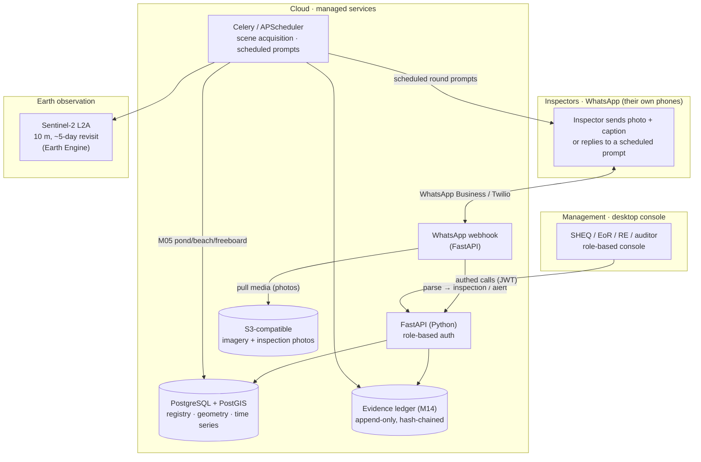

# Architecture overview

The Tailings Dam Platform monitors a TSF for conformance against its design basis and the
governing standards (GISTM as the international anchor; SANS 10286 + MHSA + DWS in South Africa).
The pilot's daily user is a **SHEQ manager**, so the platform's primary job is *adherence* — that
the inspection happened, on schedule, with defensible evidence — and *escalation* of anything
geotechnical to a named Engineer of Record.

The full module map (M01–M19 across six layers) is in
[`../spec/TSF-Monitoring-Platform-Module-Architecture-v0.4.md`](../spec/TSF-Monitoring-Platform-Module-Architecture-v0.4.md).
Phase 1 builds **four of those modules only**: M01, M03b, M05 and the M14 ledger primitives.

## Phase-1 system shape

## Key properties

- **Registry-first.** M01 is the single authoritative facility record. Analytics are *gated by
  storage method* (a dry stack has no pond, so M05 is largely inapplicable) and *by consequence
  class* (Sentinel-2 pond monitoring only suits large, high-consequence facilities). Geometry is
  PostGIS from day one. See [ADR 0002](0002-registry-first-facility-twin.md) and
  [data-model.md](data-model.md).
- **Offline-first is non-negotiable.** A TSF has no reliable coverage. The PWA completes a full
  inspection round with no signal and syncs on reconnect; the forms are *progressive*, not a
  40-item wall. See [ADR 0003](0003-offline-first-progressive-inspection.md).
- **The ledger cannot be retrofitted.** Every consequential action is an immutable, hash-chained
  event. Mutable state (e.g. "is this inspection overdue") is a *projection* over the event log,
  never a source of truth. See [ADR 0004](0004-append-only-evidence-ledger.md).
- **Uncertainty is a first-class output.** No pond area, beach or freeboard figure leaves the
  platform without its uncertainty band; M05 *refuses to publish* where expected error exceeds a
  configured fraction of typical pond area. See
  [ADR 0005](0005-site-specific-threshold-calibration.md).
- **SHEQ-manager framing.** Plain-language status + colour state on every primary screen; the raw
  number and its uncertainty are one tap away. Acknowledging an alert is never a determination of
  safety — that wording is a liability question, not a UX preference.

## Decision records

| ADR | Decision |
| --- | --- |
| [0001](0001-python-postgis-stack.md) | Python/FastAPI + PostgreSQL/PostGIS (not the Smart Club Node/Dynamo stack) |
| [0002](0002-registry-first-facility-twin.md) | Registry-first facility twin; analytics gated by storage method + consequence class |
| [0003](0003-offline-first-progressive-inspection.md) | Offline-first PWA with progressive "all normal" inspection forms |
| [0004](0004-append-only-evidence-ledger.md) | Append-only, hash-chained evidence ledger from the first commit |
| [0005](0005-site-specific-threshold-calibration.md) | Site-specific NDWI/NIR calibration recorded as audit evidence |
| [0006](0006-whatsapp-bot-field-capture.md) | Field capture is a WhatsApp bot, not an app (supersedes the PWA half of 0003) |
| [0007](0007-drone-fourth-stream.md) | Drone/UAV photogrammetry as the fourth inspection stream |
| [0008](0008-automated-reporting-cost-foundation.md) | Reports generated from the ledger; per-stream cost telemetry from day one |

For the data layout and access patterns, see [data-model.md](data-model.md).
